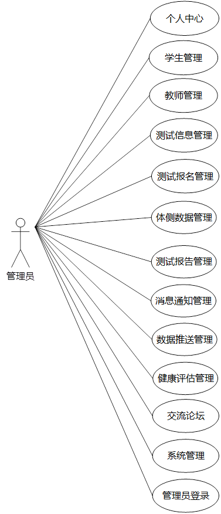

演示视频链接：https://www.bilibili.com/video/BV1LgVxzUELy/

详询 微信1：egvh56ufy7hh ，微信2：dabocode 。承接商业项目、课设、毕设和论文，包括但不限于Web、APP、小程序等，课设、毕设提供远程部署和不限次数代码解答！

功能介绍：

管理员、教师和学生三种用户角色；

技术介绍：

后端：Java语言的Spring Boot框架、MySQL8数据库、Maven依赖管理等；

前端：管理员后台使用Vue、element-ui、axios等，用户前台使用HTML、layUI、element-ui等。
